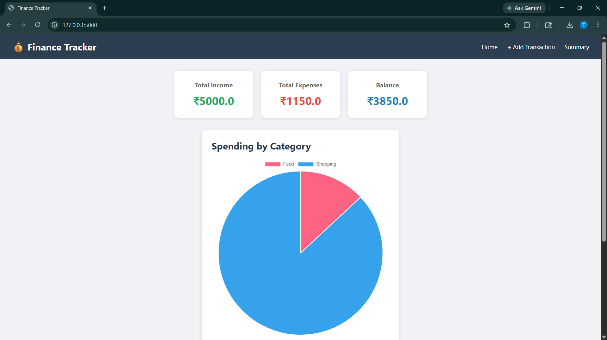
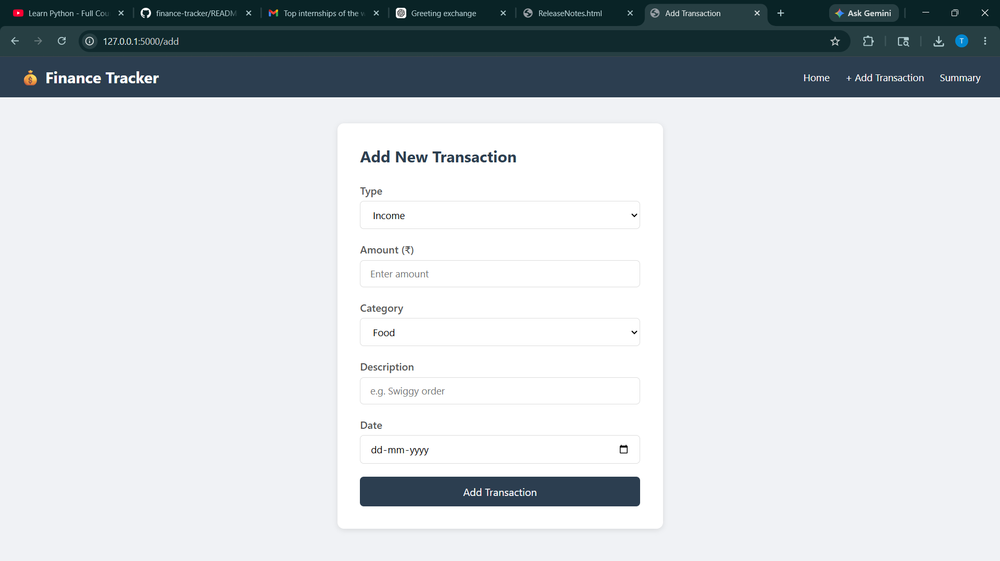

# 💰 Finance Tracker

A personal finance tracker web app built with Python, Flask, SQLite and Chart.js.

## Features
- Add income and expenses
- View all transactions
- Category-wise spending pie chart
- Monthly summary with bar chart

## Tech Stack
- Python
- Flask
- SQLite
- HTML/CSS
- Chart.js

## How to Run
1. Clone the repo
2. Install dependencies: `pip install flask`
3. Run: `python app.py`
4. Open browser: `http://127.0.0.1:5000`

## Screenshots
## Screenshots

